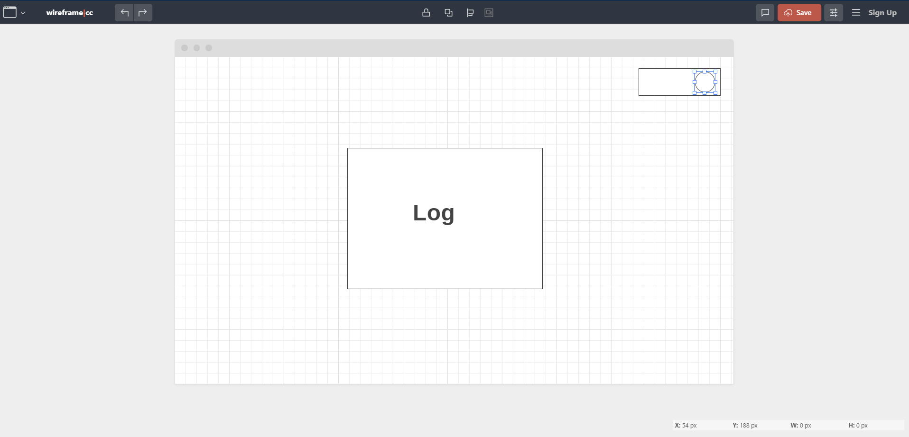
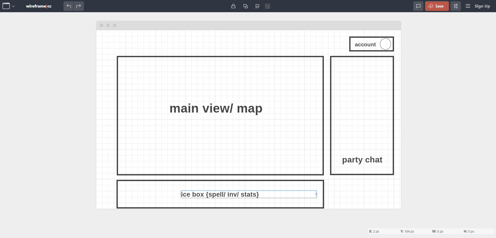

## Happy funtime folio

In the project directory, you can run:
### `npm i`
### `npm start`

Runs the app in the development mode. 
Open [http://localhost:3000](http://localhost:3000) to view it in the browser.

The page will reload if you make edits. 
You will also see any lint errors in the console.

## Wireframes
so from the start any functionality comes after a log in 
 

 

and the final result should be a main or map screen, a chat on the left side bar, an account options in the top left and as one of the ice box features so far is adding in easy click funtionality for spells or items

